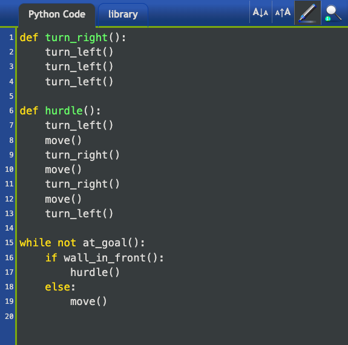
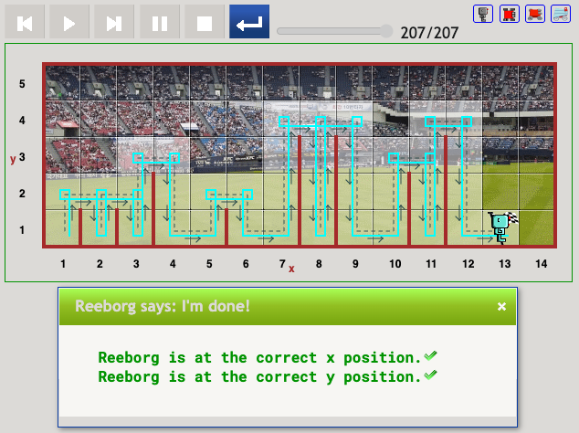

# Result Visualization for all Reborg Exercises (remaining)
Today's exercise included mainly working with the website [ReborgWorld](https://reeborg.ca/reeborg.html?lang=en&mode=python&menu=worlds%2Fmenus%2Freeborg_intro_en.json&name=Alone&url=worlds%2Ftutorial_en%2Falone.json).

### [Exercise 1](https://reeborg.ca/reeborg.html?lang=en&mode=python&menu=worlds%2Fmenus%2Freeborg_intro_en.json&name=Alone&url=worlds%2Ftutorial_en%2Falone.json)
Draw a square with Reborg. 
Code:

Result:

### [Exercise 2](https://reeborg.ca/reeborg.html?lang=en&mode=python&menu=worlds%2Fmenus%2Freeborg_intro_en.json&name=Hurdle%201&url=worlds%2Ftutorial_en%2Fhurdle1.json)
Reach the finish line and make sure to follow the predefined line.
Code:

Result:

### [Exercise 3](https://reeborg.ca/reeborg.html?lang=en&mode=python&menu=worlds%2Fmenus%2Freeborg_intro_en.json&name=Hurdle%202&url=worlds%2Ftutorial_en%2Fhurdle2.json)
Reach the finish line, but the finish is not known before the code is executed.
Code:

Results: (2 examples)

### [Exercise 4](https://reeborg.ca/reeborg.html?lang=en&mode=python&menu=worlds%2Fmenus%2Freeborg_intro_en.json&name=Hurdle%203&url=worlds%2Ftutorial_en%2Fhurdle3.json)
Reach the finish line, but the place of the hurdles are not known before the code is executed.
Code: (2 possible variants)

Results: (2 examples)

### [Exercise 5](https://reeborg.ca/reeborg.html?lang=en&mode=python&menu=worlds%2Fmenus%2Freeborg_intro_en.json&name=Hurdle%204&url=worlds%2Ftutorial_en%2Fhurdle4.json)
Reach the finish line, but the place and height of the hurdles are not known before the code is executed.
Code: (2 possible variants)

Results: (2 examples)

### [Exercise 6](https://reeborg.ca/reeborg.html?lang=en&mode=python&menu=worlds%2Fmenus%2Freeborg_intro_en.json&name=Maze&url=worlds%2Ftutorial_en%2Fmaze1.json)
Reach the finish line, but it's a maze with random spawn location and random facing.
Code:

Results: (2 examples)

### [Exercise 7](https://reeborg.ca/reeborg.html?lang=en&mode=python&menu=worlds%2Fmenus%2Freeborg_intro_en.json&name=Maze&url=worlds%2Ftutorial_en%2Fmaze1.json) 
There are 3 problematic worlds here, as per the course. Comeback after Day 15 to debug and fix them with only one solution.
